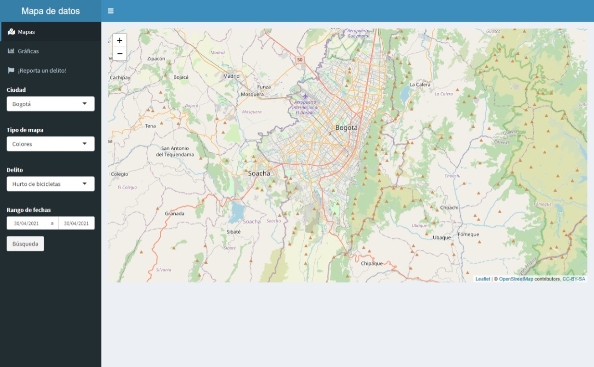
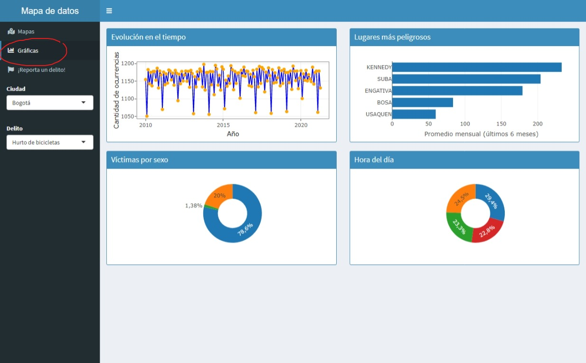
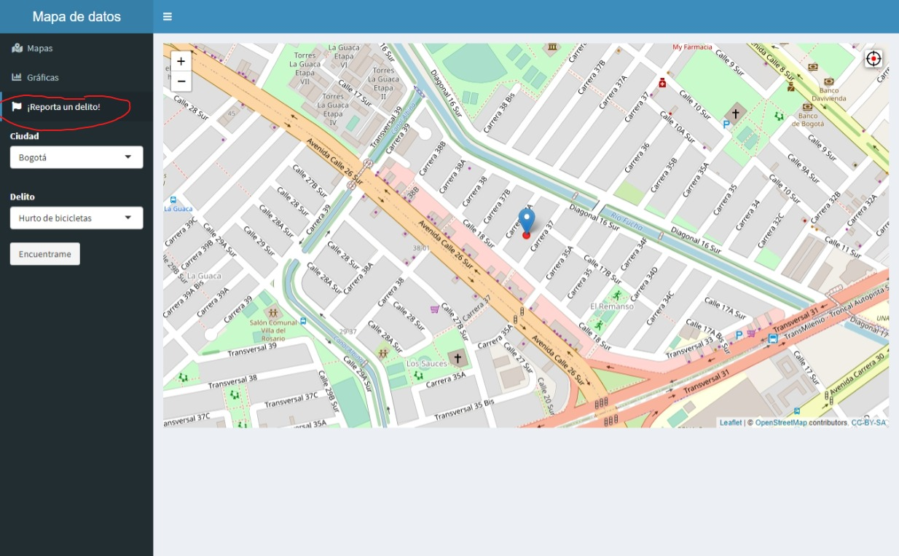

```{r, include = FALSE}
knitr::opts_chunk$set(
  collapse = TRUE,
  comment = "#>"
)
```

**Autor**: David Humberto Cardenas Pineda.

**Versión**: 2.3.

**Fecha de versión:** 15 de mayo de 2021.


### 0. Antes de empezar

Este es un manual para el uso de las aplicaciones de **mapas de crimen**, 
contenidas en el paquete `test2021` el cual funciona como repositorio/pruebas 
para el proyecto *Mapas de Crimen 2021*, por lo cual esta sujeto a cambios
constantes.

Para instalar la librería `test2021` se tienen las siguientes opciones:

- La primera es usando el archivo zip del paquete, con el procedemos a abrir el archivo `test2021.Rproj` con lo cual se abrirá un nuevo proyecto en Rstudio (necesario para proceder) y ya con esto cargado tendremos que ejecutar el comando
```{r install1, eval=FALSE}
# La libreria devtools debe estar instalada
# Usar el siguiente comando si no se encuentra ya instalada
install.packages("devtools")
# 
require(devtools)
install()
```
- Por otro lado, usando el source package (tarball) con la siguientes instrucciones
```{r install2, eval=FALSE}
# Remplazar con el PATH donde se encuentra localizado la tarball
PATH = "D:/R_projects/r_packages/path/work_pkg/"
# Correr la siguiente instruccion
install.packages(paste0(PATH,"test2021_0.2.0.tar.gz"), repos = NULL, type = "source")
```


Se cargan las siguientes librerías para el desarrollo de este manual
```{r setup}
library(test2021)
library(microbenchmark)
library(ggplot2)
library(plotly)
library(sf)
library(RSocrata)
```

### 1. API's, Shapefiles y simulaciones

#### 1.1. API'S

##### 1.1.1 Londres

Los registros de crimen cometidos dentro del Reino Unido (debidamente 
anonimizados) son de libre acceso atreves de la 
[página oficial](https://data.police.uk/) dispuesta por las mismas entidades 
gubernamentales de dicho país. En adición, la página dispone de una API 
para la obtención asistida de registros en formato JSON mediante solicitudes 
HTTP GET y POST. La guía completa de la API puede consultarse [acá](https://data.police.uk/docs/).

Particularmente para `R`, la librería `ukpolice` proporciona una interfaz que
facilita el trabajo con la API. Para el lector interesado su documentación se 
encuentra [acá](https://cran.r-project.org/web/packages/ukpolice/ukpolice.pdf).
En esta librería se proporcionan diferentes métodos para consultas
personalizadas por el usuario, punto clave para la creación de las
visualizaciones y modelos. Por lo anterior se crearon funciones 
envolventes para las rutinas de mayor uso en las aplicaciones que se
explicaran en secciones posteriores. Estas son:

- `get_crime_london_unit`: Consulta los registros de crimen dentro de un 
distrito o *ward*, para un mes especificó. 

- `get_crime_london`: Consulta global (Londres) para un mes dado. Su ejecución
toma tiempo y no se recomienda para rutinas largas.

- `avalible_dates`: Devuelve un listado de las fechas disponibles para
consulta.

A continuación se muestra un ejemplo de aplicación con una consulta
al distrito de *Croydon*, de acuerdo a los archivos de 
planificación de Londres para el 2018, para el 
mes de enero de 2021

```{r API 1}
## Captura de datos
city_of_london <- get_crime_london_unit(unit = 'Croydon', date = '2021-01',
                                        data = lon_poly_ward_b,
                                        geo_div = 'DISTRICT')
## Encabezado
head(city_of_london)
```

La declaración de parámetros para estas funciones se puede encontrar en las 
documentaciones correspondientes que pueden consultarse dentro de `R` o en
el manual general. Sin embargo, se hará mención a un parámetro común de suma 
importancia: `static`, una entrada lógica que determina si la consulta es
realizada sobre una **snapshot** de la base de datos original u obtiene
los datos mediante la API.

```{r API 2}
### Comparacion de tiempos de ejecucion en 10 iteraciones
microbenchmark(
  ## Consulta de delitos en Sutton para enero de 2021, mediante API.
  no_estatica = get_crime_london_unit(unit = 'Sutton', date = '2021-01',
                        data = lon_poly_ward_b, geo_div = 'DISTRICT'),
  ## Consulta de delitos en Sutton para eneero de 2021, mediante la snapshot.
  estatica = get_crime_london_unit(unit = 'Sutton', date = '2021-01',
                        data = lon_poly_ward_b, geo_div = 'DISTRICT',
                        static = TRUE),
  times = 10
)
```
La **snapshot** solo se encuentra disponible con la división geo-política
de Londres vigente para el año 2018, la cual se encuentra disponible en
formato `SpatialPolygonsDataFrame` en el objeto `lon_poly_ward_b`. Para
más información sobre la clase de de polígonos espaciales con base
de datos, se recomienda consultar 
[la introducción](https://cran.r-project.org/web/packages/sp/vignettes/intro_sp.pdf) al paquete `sp`  

```{r API 3}
### Listado de los distritos almacenados (2018)
unique(lon_poly_ward_b$DISTRICT)
```

Dicha **snapshot** se almacena en el archivo `db_crime_lon_a` en
formatos `list` y `tibble`. De momento la información
almacenada se agrega a nivel de distrito, sin embargo, se puede 
crear una base de datos por barrios llamando la función
`get_crime_london_unit` con los argumentos apropiados.

##### 1.1.2 Colombia

Las base de datos sobre estadísticas delictivas son dispuestas por la
Policía Nacional de Colombia mediante el Sistema de información Estadístico,
Delicuencial Contravencional y Operativo de la Policía Nacional (SIEDCO).
Aquella información de uso público concerniente a delitos de alto impacto,
entre los cuales se encuentran: homicidios, hurtos, delitos sexuales y
secuestros, son obtenibles en 
[acá](https://www.policia.gov.co/grupo-informaci%C3%B3n-criminalidad/estadistica-delictiva) ó bien en la página de [datos abiertos Colombia](https://www.datos.gov.co/), en la cual se dispone la API Socrata
para la obtención directa de datos desde `R` usando la librería `RSocrata`.

Dentro de este paquete se incluye un *script* `.R` llamado `colombia_api`, el
cual puede ser consultado siguiendo la ruta: Carpetas de librerías de `R` ->
carpeta del paquete test021 -> carpeta apidata. De ser ejecutada la rutina
se sobre-escriben las bases de datos existentes, que cubren desde enero del
año 2010 en adelante.

A continuación se muestra un ejemplo de lectura para delitos sexuales
```{r API 4}
### URL persistente para descargar la base de datos
URL <- "https://www.datos.gov.co/resource/fpe5-yrmw.json"
### Descarga mediante RSocrata
delitos_sexuales <- RSocrata::read.socrata(url = URL)
### Encabezado
head(delitos_sexuales)
```

#### 1.2 Shapefiles

Para la elaboración de los mapas de las aplicaciones se requiere de cierta
información geográfica la cual se encuentra disponible en formatos como
GeoJSON, Rasterfile, OSM, Shapefile, entre otros. Su obtención se da mediante
API's geográficas o descarga directa desde páginas de entidades gubernamentales
o empresas especializadas en cartografía. 

En cuanto almacenamiento los pesos de los archivos geográficos hace indeseable 
su descargas mediante llamado por función interna o incluirlos sin procesar, 
considerando que `R` no maneja de forma nativa los documentos con información 
geográfica. Por ello se opta por dejar a disposición inmediata las
versiones procesadas como clases de la librería `sp` que se cargan
en `.lazyLoad()`, es decir, el objeto puede ser llamado por el nombre asignado
luego de haber cargado el paquete `test2021`. 

A continuación se listan los archivos disponible, con una descripción breve
de ellos:

- `bogota`: Contiene información geográfica de Bogotá D.C. como sus 
divisiones administrativas en localidades y UPZ.
- `medellin`: Contiene información geográfica de Medellín como sus 
divisiones administrativas en comunas y barrios.
- `cartagena`: Contiene información geográfica de Cartagena como sus 
divisiones administrativas en barrios.
- `lon_poly_ward_a` y `lon_poly_ward_b`: Contiene información geográfica de
Gran Londres para de acuerdo a las legislaciones vigentes para 2014 y 2018, 
respectivamente

Para mayor información, consultar el manual del paquete.

Con el fin de mantener un registro de las operaciones realizadas se incluye
una copia de los scripts y la *pipeline* requerida para la lectura, procesamiento
y almacenamiento de cada uno de los Shapefiles (exceptuando los de Gran Londres).
Estos se pueden encontrar en la carpeta de *shapes*. Los Shapefiles originales
puede ser solicitados al autor de la viñeta por correo.

#### 1.3 Simulaciones

Como alternativa a los conjuntos de datos oficiales proporcionados por 
las entidades oficiales de Colombia, se ha optado por crear bases de datos
sintéticas a partir de reportes completos, parciales o fragmentos de 
información encontrados por la web intentando replicar las dinámicas 
espacio-temporales de los delitos. Al momento de edición de este documento
se han creado rutinas de simulación para las ciudades de Bogotá y Medellín,
para delitos como robo de bicicletas y motocicletas.

Las simulaciones de hurtos a nivel de Bogotá se realizaron siguiendo
la información aportada por la Secretaría de Seguridad y Justicia en
su boletín del mes de [septiembre de 2020](https://scj.gov.co/sites/default/files/documentos_oaiee/Boletin_2020_09_Reporte_bogota_2020_09.pdf). En lo que respecta a Medellín, los datos 
fueron obtenidos de la red [SICLAS](https://www.siclas.org/el-robo-de-bicicletas-en-medellin-percepcion-o-realidad/).

El primero de los simuladores creados consiste en selección aleatoria de 
localizaciones pre-definidas de acuerdo a la probabilidad empírica de observar
un delito en esa zona, para luego tomar muestras de puntos espaciales que 
tienen distribuciones normales bivariadas y cuya medias estan contenidas en
las localizaciones elegidas. Este simulador asume independencia espacio-temporal de 
los reportes ocasionados en diferentes localizaciones y/o días. 

Otro de los simuladores diseñados opto por una metodología en la cual se concentran
los reportes en las vías principales y secundarias de la ciudad. Para ello se 
utilizó la información disponible en OpenStreetMaps mediante la librería `osmdata` 
y las API que ella conecta, sumado al poder de procesamiento que ofrece junta a la 
librería `sf` para las *pipelines* de generación de muestras de puntos sobre las 
vías.

Dado que no todas las vías cuentan con la misma propensión de ocurrencia de 
cierto delito, se ha diseñado (aún en progreso) una modificación del simulador
donde la probabilidad de selección de una vía es proporcional a la velocidad
media registrada, la cual se cataloga en uno de los tres siguientes tres
grupos: transitó lento, transitó moderado y transitó rápido. La asignación a
cada una de estas categorías esta aún pendiente de definición, pero se
idealmente se planea dejar de acuerdo a la selección del usuario conjunto 
a un índice creado a partir de las velocidades medias reportadas, el día de 
la semana, la hora del día y las distancias recorridas. 

*Nota:* Al momento de creación de este documento, la obtención de la información
auxiliar ha presentado las siguientes dificultades:

1. No siempre pueden ser obtenidos usando alguna API libre, y de serlo el tamaño
de la información excede la capacidad del paquete, por lo cual debe usarse
como datos externos cuyos tiempos de carga son extensos.

2. Los datos requieren de un procesamiento profundo para ser útiles, entre 
dichos procesos se encuentra la selección de avenidas principales, cuyos nombres
o identificadores no son estandarizados presentando incongruencias con las
bases de datos obtenidas de OpenStreetMaps (referente principal sobre el tipo
de vías)

3. Si bien el simulador se concibe utilizando la información de velocidades medias
el objetivo del muestreador era la asignación mediante el grado/nivel de 
tráfico.

##### 1.3.1. Rutinas especiales

Con el fin de mantener un registro de las operaciones realizadas se incluye
una copia de los scripts de simulación dentro de la carpeta *otros*. Algunos
archivos no estan disponibles en el paquete pero pueden ser solicitados
al autor por correo. No obstante, con la finalidad de facilitar el acceso
a este tipo de metodologías para otras ciudades y contextos se creó una
serie de funciones necesarias para correr una gran parte de los procedimientos
requeridos sin la necesidad de crear el código desde cero.

La primera función de este grupo es `simular_delito_divisiones` que copia 
la metodología de la primera simulación por localizaciones/divisiones 
geográficas, geo-políticas, administrativas o de otra índole. En seguida se
presenta como ejemplo la simulación realizada con la ciudad de Bogotá

```{r simu1}
### Comenzamos introduciendo una informacion requerida por las rutinas
## 1. Un data.frame que contenga el Nombre de la division en una columna llamada
## NOMBRE_DIV1 y el código de esta en CODIGO_DIV1. Ademas, se debe incluir una
## columna (PROP) que contenga la probabilidad de que ocurra un delito en ese
## sector en particular
incidencia <- c(145, 296, 752, 33, 291, 240, 1195, 540, 1348,
                172, 367, 190, 101, 156, 1090, 341, 181, 517, 68)
lista_localidades <- unique(bogota@data[,c("CODIGO_DIV1","NOMBRE_DIV1")])
df_prop_localidad <- cbind(lista_localidades[order(lista_localidades$NOMBRE_DIV1),],
                           prop.table(incidencia))
names(df_prop_localidad)[3] <- "PROP"
## 2. Un data.frame que contenga las coordenadas de todos los kernels contenidos
## dentro de una localizacion seleccionada
raw_kernels <- "NOMBRE_DIV1,LATITUD,LONGITUD,PROP
Usaquen,4.74578,-74.04714,0.35
Usaquen,4.71815,-74.05190,0.35
Usaquen,4.69823,-74.05235,0.2
Usaquen,4.72008,-74.0358,0.1
Suba,4.7195,-74.0725,0.15
Suba,4.7444,-74.0940,0.35
Suba,4.7478,-74.1001,0.35
Suba,4.7478,-74.1169,0.15
Engativa,4.6913,-74.0902,0.2
Engativa,4.7076,-74.0964,0.2
Engativa,4.6967,-74.1054,0.2
Engativa,4.7006,-74.1172,0.4
Fontibon,4.6644,-74.1121,0.45
Fontibon,4.6620,-74.1327,0.2
Fontibon,4.6734,-74.1447,0.35
Kennedy,4.6296,-74.1398,0.3333333
Kennedy,4.6398,-74.1566,0.3333333
Kennedy,4.6429,-74.1641,0.3333333
Bosa,4.6247,-74.1790,0.65
Bosa,4.6072,-74.1819,0.35
Chapinero,4.6481,-74.0636,0.5
Chapinero,4.6400,-74.0653,0.5
Barrios unidos,4.6852,-74.0589,1
Teusaquillo,4.629,-74.0781,1
Santa Fe,4.5912,-74.0827,1
Candelaria,4.5912,-74.0827,1
Martires,4.6053,-74.0975,1
Puente Aranda,4.6852,-74.0589,1
Antonio Narino,4.5828,-74.1024,1
Rafael Uribe,4.5828,-74.1024,1
Tunjuelito,4.594,-74.1406,1
San Cristobal,4.5813,-74.0860,1
Usme,4.5398,-74.1148,1
Ciudad Bolivar,4.5637,-74.1472,1"
localidad_kernel <- read.csv(text = raw_kernels)
# Pasamos los nombres a mayusculas para mantener compatibilidad
localidad_kernel$NOMBRE_DIV1 <- toupper(localidad_kernel$NOMBRE_DIV1)
### Definimos un rango de dias (inicio y fin) en el formato "AAAA-MM-DD"
### Luego, procedos a ejecutar la simulacion
rango_dias <- c("2020-01-01","2020-03-01")
resultado_simulacion <- simular_delito_divisiones(rango_dias, 
                                                  df_prop_localidad,
                                                  localidad_kernel)
head(resultado_simulacion)
```

Consultar la documentación de la función para mayor información sobre la rutina.
Por otro lado, para complementar la información de la simulación base se 
proporciona la funcionalidad `simular_variables_adicionales` la cual
admite objetos `data.frame` asignados con una clave `df_prop_***` donde los
asteriscos se remplazan por el nombre de la variables (sin acentos, usando
rayas al piso para espacios). En seguida se encuentra un ejemplo con la 
adición de sexo y rango del día en que ocurrió el delito

```{r simu2}
### Definimos las proporcionalidades para reparticion de sexo y rango de 
### dia.
# Sexo
df_prop_sexo <- data.frame(
  SEXO = c("FEMENINO", "MASCULINO", "NO REPORTA"),
  PROP = prop.table(c(1579, 6332, 112))
)
# Rango dia
df_prop_rang_dia <- data.frame(
  RANG_DIA = c("MADRUGADA", "MAÑANA", "TARDE", "NOCHE"),
  PROP = prop.table(c(1868, 2387, 1915, 1791))
)
### Ingresamos las nuevas variables en el data.frame inicial
resultado_simulacion <- simular_variables_adicionales(resultado_simulacion,
                              df_prop_sexo = df_prop_sexo,
                              df_prop_rang_dia = df_prop_rang_dia)
head(resultado_simulacion)
```

### 2. Visualizaciones dentro de R

Para realizar las visualizaciones dentro de `R` se utiliza
el paquete `leaftlet` en principio y entre sus primeras aplicaciones se
encuentra la creación de los mapas con divisiones geo-políticas de 
localizaciones como Bogotá, Colombia y Londres, Inglaterra, gracias a la
función `draw_city`. Para su uso se requiere de un `shapefile`
con el formato `SpatialPolygonsDataFrame` previamente discutido, en adición al
nombre de la columna que contiene la información referente a la 
división de interés. En seguida se muestra un ejemplo con el croquis
de los distritos de Londres (para 2018).

```{r graph 1, fig.align="center", out.width = "80%", fig.height=6}
### Creacion del mapa de Londres - 2018, por distritos
mapa <- draw_city(city_file = lon_poly_ward_b, merge_on = 'DISTRICT')
### Llamar para ver la grafica en pantalla
mapa
```

Ya con un mapa disponible se puede usar una función que agregue elementos
adicionales como `crime_london_map`, en el caso de la ciudad de Londres, 
la cual incluye marcadores agregados que señalan la ubicación de delitos 
cometidos durante un mes específico. Además, esta función dispone de un 
argumento `top_n` que permite controlar el total de categorías que se muestran
en la leyenda y al pasar el puntero sobre los marcadores (desagregados). 
A continuación se presenta un ejemplo de uso para una consulta en el distrito
de Sutton para el mes de marzo del 2019.

```{r graph 2, fig.align="center", out.width = "80%", fig.height=6}
### Llamar la funcion con el mapa ya creado de Londres
crime_london_map(map = mapa, location = 'Sutton', date = '2019-03')
```

El paquete `test2021` también puede ser implementado conjunto a los paquetes
`ggplot2` y `plotly` para la representación de mapas estáticos y dinámicos,
como sucede con los cartogramas continuos y de Dorling. Estos son creados
con la función auxiliar `get_cartogram`, en la cual se selecciona una variable 
que asignara peso a cada una de las geometrías (divisiones geo-políticas) y a 
partir de esto obtiene una representación distorsionada del mapa base. A 
continuación se presenta un ejemplo donde se representa los departamentos de 
Colombia según el total de población registrada en el censo del 2018.

```{r graph 3, fig.align="center", out.width = "90%", fig.height=6}
### Dibujar los departamentos de Colombia segun su poblacion (TOTPOP)
# Se crea un SpatialPolygonsDataFrame de departamentos
# La funcion db_sp_merge se explica adelante
sp_dpto <- db_sp_merge(col_coor_dept, col_dept, 'DPTO_CCDGO')
# Crear el cartograma continuo para Colombia
cartos <-get_cartogram(sp_dpto, 'TOTPOP', 3118)
# Casteo para que el objeto sea aceptado por plotly
cartos <- sf::st_cast(cartos, "MULTIPOLYGON")
# Creacion de intervalos para la leyenda
br_stat <- test2021::classIntervals(c(min(cartos$TOTPOP)-0.001,
                                      cartos$TOTPOP),
                                    n = 5, style = 'jenks')
# Grafica base en ggplot
plt <- ggplot2::ggplot() +
  ggplot2::geom_sf(data = cartos,
                   ggplot2::aes(fill = TOTPOP/1e6, text = DEP_NOM)) +
  ggplot2::theme_bw(base_size = 12) +
  ggplot2::scale_fill_fermenter(breaks = round(br_stat$brks/1e6,2), palette = 'YlOrRd') +
  ggplot2::guides(fill = ggplot2::guide_colorbar(
    title = 'Millones',
    ticks = TRUE,
    even.steps = FALSE,
    frame.linewidth = 0.55,
    frame.colour = "black",
    ticks.colour = "black",
    ticks.linewidth = 0.3)) +
  ggplot2::theme(axis.text.x = ggplot2::element_blank(),
                 axis.text.y = ggplot2::element_blank())
# Ahora se pasa a plotly
pp <- plotly::ggplotly(plt, tooltip = "text") 
# Un pequenno truco para que los nombres de los departamentos puedan ser vistos
# https://github.com/ropensci/plotly/issues/1641
pp %>%  plotly::style(
    hoveron = "fills",
    line.color = plotly::toRGB("gray40"),
    traces = seq.int(2, length(pp$x$data))
  ) %>%
  plotly::hide_legend()
```

Al momento de publicación de este manual, no se disponen de otras gráficas
directas en `R`, pero se pueden adaptar los códigos anteriores para
incluir los objetos devueltos por las siguientes funciones auxiliares, que 
son base para las App Shiny.

- `sp_crime_cat`: Usada para calcular la densidad de un crimen específico 
en la ciudad de Londres en una fecha dada y a nivel de distritos/barrio. 
Crea un objeto `SpatialPolygonsDataFrame` que puede usar `leaflet`
para crear coroplétas mediante la rutina `addPolygons`.

- `sp_crime_pre`: Función destinada al pre-procesamiento de los 
shape files de Londres que puede ser adaptada a otros objetos que
deseen ser agregados en divisiones geo-políticas más grandes a las 
dispuestas por el propio archivo. Dentro del procesamiento previo
incluye la agregación de una variable numérica que es agrupada
por la división geo-política suministrada, como puede ser la
densidad de población o el área total.

```{r aux fun 1}
### Llamar a la base pre-procesada para los distritos de Londres
### Se agrega por area total del distrito (en hectareas)
df_pre <- sp_crime_pre()
### Calcular la densidad por unidad de hectarea de los delitos relacionados 
### con drogas durante enero de 2020
drogas_sp <- sp_crime_cat('Drogas', '2020-01', df_pre)
### Ver clase de objeto creado
print(class(drogas_sp))
### Ver un resumen del data frame asociado
print(str(drogas_sp@data))
```

- `get_cl`: Realiza cálculos de contornos a partir de la estimación de 
kernels bivariados normales ajustados a una selección de localizaciones.
Puede ser aplicada para crear mapas de calor para una categoría 
particular de crimen.

- `db_sp_merge`: Mezcla una base de datos con un objeto 
`SpatialPolygonsDataFrame` por medio de un *join* a izquierda del último
sobre el primero, permitiendo una sencilla manipulación de los argumentos
pasados a `leaflet`.

- `hex_bin`: Transforma una base de datos de puntos geo-localizados
(latitud-longitud) en una grilla de hexágonos con información
adjunta, la cual puede usarse en `leaflet`.

### 3. Shiny app

Una alternativa para la creación de la aplicación final es usar el poder conjunto 
de `R` y su paquete estrella Shiny, por ello se propuso varios prototipos 
de Apps para este fin. Actualmente, las Apps disponibles son

1. Londres: visor de crimen principales por sectores. 
2. Londres: visor de crimen principales por sectores (carga rápida).
3. Londres: mapa coroplético de crimen con marcadores.
4. Londres: mapa de calor.
5. Colombia: mapa coroplético, de calor y hexágonos.
6. Mapa de datos: Condensa las funcionalidades anteriores en un solo dashboard
e incluye otras adicionales.

La forma de correr las aplicaciones es mediante la instrucción
`run_shiny` como se muestra a continuación

```{r allowed apps, error=TRUE}
run_shiny('Nombre de mi aplicación')
```
Lo anterior sucede cuando no se ingresa un nombre valido de App, el cual
se refiere a la carpeta donde redicen los archivos necesarios para que esta 
funcione. Los nombres validos son los regresados por las instrucción
`run_shiny` con cualquier *string* (menos alguno de los nombres
aceptados, claro), los cuales se explican a continuación.

- `crime_visor_london` llama al  visor de crimen principales por sectores
para la ciudad de Londres.

- `crime_visor_london_static` realiza lo mismo que la anterior aplicación
pero en tiempos menores por ejecutarse sobre la *snapshot*.

- `crime_selector_london` ofrece un mapa coroplético para la ciudad de 
Londres con marcadores activados al realizar click sobre un polígono dado.

- `crime_heat_map_london` para realizar una visualización de líneas de 
contorno que aproximan kernels bivariados de la distribución espacial de 
los delitos filtrados por categoría y fecha, en la ciudad de Londres.

- `crime_colombia`, un visor general para Colombia que ofrece dos tipos
de visualizaciones: coroplétas y mapa de calor. Para el primer caso
se ofrece una capa a nivel departamental que puede expandirse al realizar
click mostrando los municipios asociados.

- `crime_colombia_city`, un prototipo de Dashboard que ofrece las
funcionalidades de `crime_colombia` pero para algunas de las ciudades 
principales de Colombia. Aún esta en una etapa temprana mientras se
obtienen los datos oficiales.

- `mobile_crime_colombia`, una modificación al prototipo `crime_colombia_city_2`
que busca adaptar la presentación de la aplicación a dispositivos moviles. 
De momento se esta trabajando en su frontend, pero se tiene proyectado 
corregir la presentación e interactividad de los recursos.


- `mapa_de_datos`, se considera como una extensión de `crime_colombia_city`, el
cual se busca generalizar para cualquier ciudad o entidad territorial del mundo.
Integra las funcionalidades de predicción, que aún se están desarrollando y se
describen en la siguiente sección.

Se cierra esta sección presentando la App de ciudades de Colombia

```{r demo shiny, eval=FALSE}
### PENDIENTES CAPTURAS DE PANTALLAS
run_shiny('crime_colombia_city')
```

Al ejecutar la App se podrá observar el Dashboard siguiente

```{r Dashboard_A, echo = FALSE, fig.cap="Vista principal", out.width="90%"}

```

En la vista principal de mapas se puede elegir a voluntad las opciones que
disponibles en el *slider* izquierdo para cambiar la ciudad, el tipo
de delito, el tipo de mapa/presentación y el rango de fechas a consultar. 
Algunas opciones de mapas presentan funcionalidades adicionales cuya 
presentación se prefiere dejar en un vídeo que se puede consultar [acá](https://youtu.be/p-ak44NMUjs)

Al hacer click en la opción de gráficas (resaltada) se obtendrá una serie
de presentaciones visuales interactivas creadas con la librería `plotly`

```{r Dashboard_B, echo = FALSE, fig.cap="Gráficas interactivas", out.width="90%"}

```

Finalmente, el panel de reportes (resaltado) permitirá al usuario ubicar 
el lugar donde fue victima o espectador de un delito. Para mejorar la 
experiencia del usuario se incluye el botón *Encuentrame* que centra
el mapa en la localización aproximada del dispositivo (siempre y cuando
se realice en navegador y se permita el acceso al GPS). Al aparecer el
marcador en el mapa, ya sea por el uso de GPS o por click directo aparece
el botón de *Reportar* para que el usuario pueda continuar sin problemas.

```{r Dashboard_c, echo = FALSE, fig.cap="Reportes de usuarios", out.width="90%"}

```

Se debe mencionar que los reportes aún no cuentan con una integración con una
base de datos persistente, pero a futuro esta será diseñada usando SQL y
estará localizada en el servidor remoto donde se alojará el aplicativo.

### 5. Modelos de predicción

Siendo uno de los objetivos del proyecto de mapa de datos la predicción de 
delitos, ya sea obtener conteos que existirán para un día determinado o 
aproximar la probabilidad de ocurrencia en una localización de destino, 
en esta sección se discuten las herramientas dispuestas por el paquete
para el procesamiento de la información para la creación de modelos
estadísticos o de aprendizaje de maquina para la consecución del objetivo 
expuesto.

Algunas de las funciones son automáticas con cierto grado de personalización 
en los parámetros, mientras que otras son destinadas a una línea de trabajo
manual donde se pueda experimentar con los datos con un análisis con mayor
detalle. A continuación se expondran dichas funciones siguiendo los 
lineamientos de las últimas mencionadas, donde se inicia con el tratamiento
de la información, creación de nuevas variables, entre otras técnicas de
pre-procesamiento. Luego, se expone la selección de modelos siguiendo un
enfoque de ciencia de datos con el ajuste sobre un conjunto de entrenamiento,
una verificación de la calidad del modelo con una validación y una prueba
final de lanzamiento con una prueba.

#### 5.1. Pre-procesamiento

Antes de comenzar con la línea de procesamiento, se espera que el conjunto
de datos a procesar presente la siguiente estructura como mínimo:

1. Su formato/clase debe ser `data.frame`, `tibble` o `data.table`. En algunos
casos se admite `sf` pero se recomienda los anteriores mencionados para 
evitar conflictos.

2. Una columna que contenga la fecha de observación, la cual debe estar en un
formato reconocible como "AAAA-MM-DD" o "DD/MM/AAAA" (consultar formatos
`POSIXct` y `Date`). Esta puede información con mayor granularidad como
horas, minutos, entre otros. 

3. En caso de contener información puntual de la ocurrencia de un delito, debe
contener dos columnas que alberguen las coordenadas del punto observado. Los nombres
de dichas columnas deben tener alusión a *longitud* y *latitud*. Por ejemplo,
se aceptan nombres para longitud como *long*, *longitude*, *lng* y *LONGITUDE*.

De incluir otras variables se debe seguir las guías incluidas en las 
descripciones de cada función. En general, se recomienda al usuario verificar
que los datos estén completos y que las series de tiempo manejadas sean
de tipo regular (intervalos de observación con la misma separación)

Contando ya con un conjunto adecuado, se puede acudir a una de las siguientes 
funciones de creación de variables adicionales

- `add_laggs`: En algunos escenarios cuando se requiere usar la información
de la variable dependiente para poder predecir valores futuros de ella misma
sin usar de forma explicita modelos de series de tiempo o cambios en las
metodologías para soportar la dependencia serial. Para lo anterior, esta 
función ofrece el aumento de la matriz diseño/matriz de características *X* 
a partir de valores de la variable objetivo *Y*

*Nota:* La función anterior solo funciona con observaciones correspondientes 
a una sola serie temporal, con medidas únicas por unidad de tiempo y observada
en intervalos regulares.

- `fill_series`: No siempre se tendrán las series completas, aunque estas
puedan ser definidas en intervalos regulares tomando valores por defecto en
donde haga falta. Esta función acepta un vector *Y* de observaciones de una
serie, junto a las unidades de tiempo de observación (en formato `Date`),
el **delta** del tiempo de la serie a completar, es decir, la **distancia**
entre cada unidad de tiempo (e.g. un día, una semana, un mes) que tendría
la serie regular completa y el valor con que se llenarían las observaciones
faltantes que se asume cero por defecto.

```{r pre_pro1}
#### Creacion de una serie de juguete para mostrar la funcionalidad
#### fill_series() y add_lags()
### Semilla 
set.seed(2021)
### ARIMA(1,0,1)
Y <- stats::arima.sim(model = list(ar = 0.8, ma = 0.4), n = 100)
### Matriz de caracteristicas. Se crea de un mayor tamaño para eliminar fechas
X <- data.frame(FECHA = seq(as.Date("2020-01-01"), length = 120, by = "1 day"),
                LNG = rnorm(120, -74.07205, 0.001),
                LAT = rnorm(120, 4.6240, 0.001))
X_red <- X[c(order(sort(sample(1:119,99))),120),]
### Adicion de ceros en los lugares faltantes
Y_fill <- fill_series(Y, X_red$FECHA, time_delta = "1 day", fill = 0)
### Verificamos que aumento
c(length(Y),length(Y_fill))
### Ahora se ingresan la variable rezagada 3 periodos
X_aug <- add_laggs(X, Y_fill, p = 3)
head(X_aug)
```

- `date_split`: Las fechas pueden ser mejor tratadas si se separan en variables
nuevas como año, mes, entre otras. Esta función recibe un vector de fechas 
y devuelve una lista con los campos solicitados, que por defecto son: año, 
mes, número de semana, día de la semana y rango del día (madrugada, mañana,
tarde y noche)

- `add_date_split`: Esta función permite al usuario ingresar la matriz *X*, el
nombre de la columna de la fecha y los campos que requiere obtener. En su lugar,
recibe una matriz *X* aumentada con la fecha dividida en los campos retornados,
pero sin la columna fecha para evitar redundancias y problemas de colinealidad.

```{r pre_pro2}
#### Usamos la anterior informacion simulada para presentar el resultado
X_split_date <- add_date_split(X,"FECHA",day_range = FALSE)
head(X_split_date)
```

- `add_spatial_f`: En algunos casos la información obtenida por solo las 
coordenadas es insuficiente, por ello es necesario proveer una agrupación
o agregado que represente lugares con un significado particular como puede
ser alguna división territorial. Esta función toma una base de datos con
información de puntos espaciales, un objeto de geometría/polígonos en 
formato `sp` o `sf` y el nombre de las columnas del anterior objeto que
desean ser incluidas en la nueva matriz *X*.

```{r pre_pro3}
#### Usamos la anterior informacion simulada para presentar el resultado
#### Los puntos son generados aproximadamente dentro de Bogota, 
#### por ello se utiliza el objeto "bogota" que viene incluido en el paquete.
X_w_spatial <- add_spatial_f(X,bogota,"NOMBRE_DIV1","CODIGO_DIV1")
head(X_w_spatial)
```

*Nota*: La anterior función puede arrojar advertencias si detecta que algunos
puntos estan localizados fuera del objeto espacial proporcionado, entregando
menos filas de las reportadas en *X*.

- Las funciones para crear las particiones entrenamiento/validación/prueba 
son `create_split_ts` y `create_split_long`. La primera es para series de 
tiempo y la segunda para datos de tipo longitudinal.

- `split_by_factors`: función de uso interno para la creación de las 
particiones, no obstante puede ser usada por separado para crear múltiples
sub-matrices *X* en función de una o varias columnas que contengan factores.

#### 5.2. Modelos de benchmark

Tras el procesamiento de datos se continua con el reporte de algunos modelos
que sirven como referencia para aquellos que serán usados en forma, entre
ellos se encuentran los modelos de regresión lineal y serie lineales univariadas
(ARIMA).

Para el caso del modelo de regresión lineal se dispone de la función
`lin_mod_selector` que recibe una partición entrenamiento/validación/prueba 
creada utilizando alguna de las funciones de pre-procesamiento. Esta 
retorna una lista con el mejor modelo, el **RMSE** de la predicción un paso
adelante en entrenamiento y validación, en adición de una salida en consola
del resumen del modelo obtenido si se usa el parámetro `quiet=FALSE`.

```{r mod_lineal, results='hide', message=FALSE}
### Modelos de regresion lineal - Hurto de bicicletas
# Lectura del conjunto de datos
bici_db <- lon_hurto_bicicletas
bici_db <- subset(bici_db, select = c(FECHA, CODIGO_DIV1, 
                                       CODIGO_DIV2, SEXO,
                                       RANG_DIA))
# Cambiar formato de fecha
bici_db$FECHA <- as.Date(paste0(bici_db$FECHA,"-01"))
# Crar una DT 
bici_dt <- data.table::as.data.table(bici_db)
# Creacion de los conjuntos de datos tratados
db_1a <- as.data.frame(bici_dt[,.N,.(FECHA, CODIGO_DIV1)])
db_1a <- fill_long(db_1a$N, subset(db_1a, select = -N),
                  date_col = "FECHA", time_delta = "1 month")
db_dates_a  <- db_1a$FECHA
db_1a <- add_date_split(db_1a, "FECHA", week = FALSE, day_range = FALSE,
                       week_day = FALSE)
db_1a$ANNO <- as.numeric(db_1a$ANNO)
fct_split_db_1a <- split_by_factors(db_1a, "CODIGO_DIV1")
# Partir en respuesta y features
Y_1a <- db_1a$y
X_1a <- subset(db_1a, select = -y)
# Creacion del split
split_1a <- create_split_long(Y = Y_1a, X = X_1a, split_prop = c(0.6,0.2,0.2),
                             factors = "CODIGO_DIV1")
# Los modelos lineales propuestos
mod_lin_1a <- lin_mod_selector(split_1a, quiet = TRUE)
# La salida correspondiente
summary(mod_lin_1a$selected_model)
```

Para los modelos lineales se dispone la función `linmod_metrics()` para 
obtener algunas medidas de rendimiento en el conjunto de entrenamiento y
validación.

En el caso de ARIMA se disponen dos funciones de selección de modelos
`arima_mod_selector()` y `arimax_mod_selector()`, cuya diferencia radica
en la inclusión de variable exógenas (ARIMAX) o no, usando solo el componente
de serie temporal endógena (ARIMA). Ambas retornar una lista de modelos
ajustados por sectores determinados por la selección de una columna
de factores, donde cada modelo tendrá unos **RMSE** asociados en entrenamiento
y validación. Todos los procedimientos implementados para su ajuste estan
basados en la librería `fable`, el cual se explica en el siguiente [libró](https://otexts.com/fpp3/) 

```{r mod_arima}
### Modelos ARIMA - Hurto de bicicletas
# Adicionar fechas
X_3a <- X_1a
X_3a$FECHA <- tsibble::yearmonth(db_dates_a)
# Creamos el db agregado por fechas
split_3a <- create_split_long(Y = Y_1a, X = X_3a, factors = "CODIGO_DIV1",
                             split_prop = c(0.7,0.15,0.15))
# Correr los modelos independientes
mod_arima_a <- arima_mod_selector(split_3a, dates_col = NULL, factor_split = "CODIGO_DIV1")
# El rmse completo seria
sqrt(mean(sapply(mod_arima_a$models, function(x){x$rmse_val})^2))
# Los resumenes
dump <- lapply(mod_arima_a$models,function(x)fabletools::report(x$model))
# Las medidas de rendimiento
metricas_a <- arima_metrics(mod_arima_a, split_3a, factor_split = "CODIGO_DIV1")
head(metricas_a)
```

De la misma manera que el modelo líneal, los modelos ARIMA y ARIMAX cuentan con
las rutinas `arima_metrics` y `arimax_metrics()` para la obtención de
métricas de rendimiento calculadas, de forma respectiva. 

Existen otro modelos propuestos más haya de los lineales y los ARIMA, estos
pueden encontrarse en la viñeta `modelos_ejemplos` donde se acompaña con
un análisis detallado de dos conjuntos de datos y un paso a paso sobre
la implementación de los modelos predictivos con sus interpretaciones.


### 4. Referencias

Hyndman, R and Athanasopoulos, G (2021) **Forecasting: Principles and practice**, 3rd edition, OText: Melbourne, Australia. OTexts.com/fpp3
